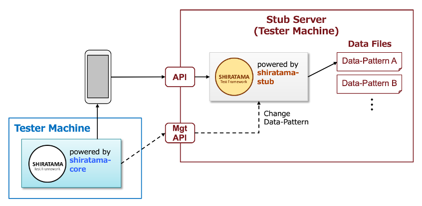

# Shirates (shirates-stub)

**Shirates** is an integration testing framework that makes it easy and fun to write test code for mobile apps.

**shirates-stub** project is a template stub application.

## Document

- [Document index](./docs/markdown/index.md)
- [Quick start guide](./docs/markdown/quick-start.md)

## Features in 3 lines

1. You can implement fake APIs of your application for testing.
1. You can put data files in directories corresponding to data pattern name.
1. You can change data pattern for the API with management API/page.

## System overview

## What and why Shirates?

- The prototype of this framework was named SHIRATAMA Test Framework. We call open source version Shirates.
- SHIRATAMA is Japanese sweets [Shiratama dango]
- and it looks like “O” (initial letter of OK)

## Development environment

- OS: macOS or Windows
- IDE: IntelliJ IDEA (Ultimate or Community)
- Programming language: Kotlin

[Shiratama dango]: https://www.google.com/search?q=Shiratama+dango&rlz=1C5CHFA_enJP809JP809&source=lnms&tbm=isch&sa=X&ved=2ahUKEwiD08mKsI_uAhU-xYsBHdpfDAkQ_AUoAXoECA4QAw&biw=1570&bih=1497

 

- [index]

[index]: docs/markdown/index.md

 
