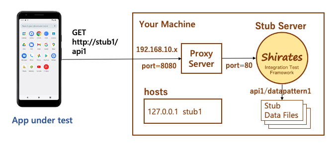
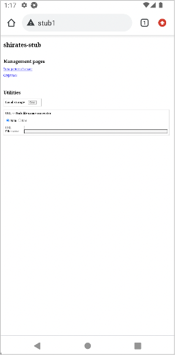

# Setting up proxy

shirates-stub is designed for single user, so you should run stub application on your machine.

Assuming the app under test is built to access http://stub1/api1, the hostname "**stub1**" needs to be resolved to the
IP address of your machine.

You should set up **proxy server** and **hosts** on your machine as follows.



## Example

1. Set up a proxy server on your machine. `192.168.10.5` is IP address leased by DHCP server.


2. Bind loopback address `127.0.0.1` to stub1 in hosts file.

```
127.0.0.1    stub1
```

If configured properly, you can access to the stub server using stub1. Open the browser and go to "http://stub1/". You
can see shirates-stub menu page.

3. Set up proxy on the mobile device.


4. Access to `http://stub1`.



5. Access to `http://stub1/product/list?plain`.


Now your app can access to stub APIs by host name stub1.

## Network Address (Android emulator only)

Dynamically allocated IP address may be changed from time to time.
If you deploy stub server on local host, special address 10.0.2.2 is useful.

| Network Address | Description                                                                                 |
|:----------------|:--------------------------------------------------------------------------------------------|
| 10.0.2.2        | Special alias to your host loopback interface (i.e., 127.0.0.1 on your development machine) |

See [Set up Android Emulator networking](https://developer.android.com/studio/run/emulator-networking)


<br>

- [index](../index.md)

<br>
