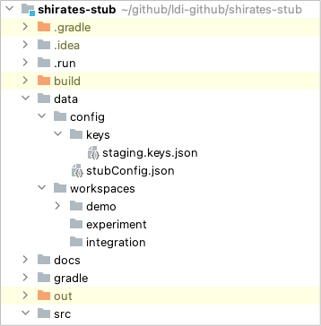

# Data directory

**data** directory contains configuration files and workspaces.

## staging.keys.json

This file contains keys for encryption. File name is arbitrary. You can use `develop.keys.json` instead.

See [keys.json](keys_json.md)

## stubConfig.json

You can configure workspace path, keyFile path, and other parameters in this file.

See [stubConfig.json](stub_config_json.md)

## workspaces

This directory contains subdirectories that contain stub data files.

See [workspaces](workspaces.md)

 

- [index](../index.md)

 
