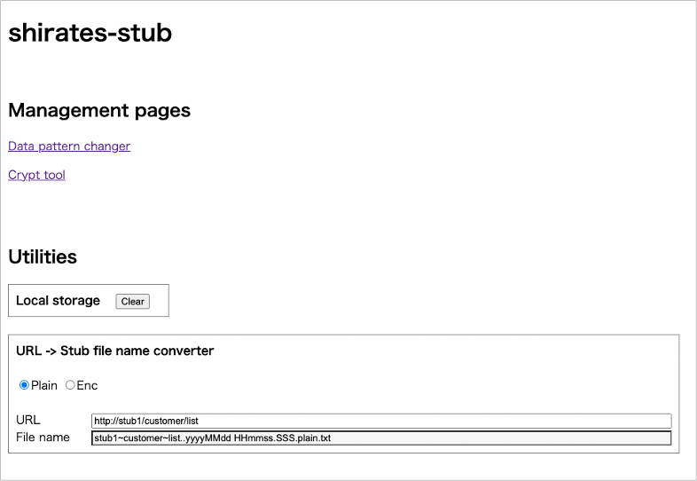

# Data pattern file

## Data pattern file name

You can convert URL to data pattern file name as follows.

1. Remove scheme ("https://" or "http://")
2. Convert "/" to "~"
3. Convert ":" to "="
4. Append ".."
5. Append any label
6. Append ".plain" or ".enc"
7. Append ".json" or ".txt"

## URL -> Stub file name converter

Use **converter** to convert URL to data pattern file name.

 

- [index](../index.md)

 
