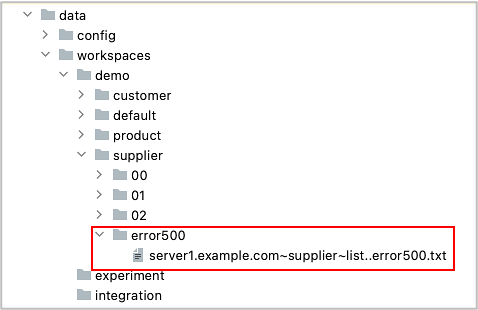
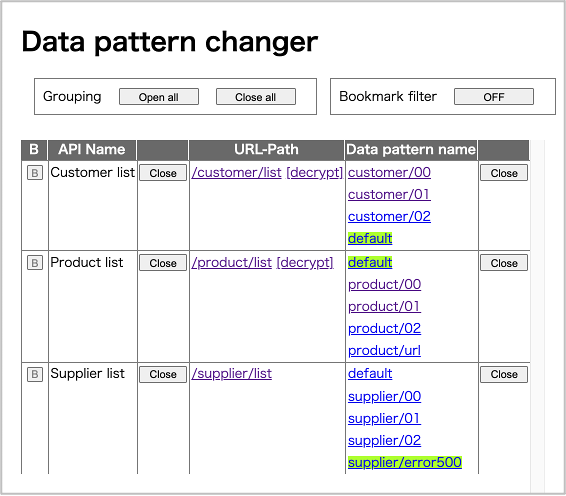
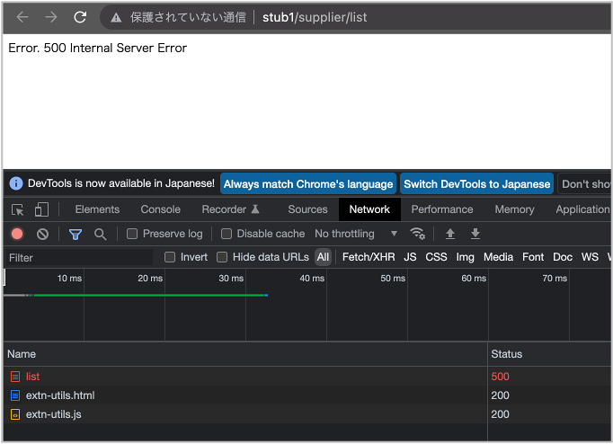

# Http status error file

You can set data pattern as http status error.

## Example

1. Create data pattern directory for http status 500 under `demo/supplier`.

2. Put empty file named `server1.example.com~supplier~list..error500.txt`

3. Open data pattern changer, then click the data pattern name.

4. Click URL-Path. You will get error response with message.

 

- [index](../index.md)

 
