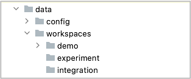
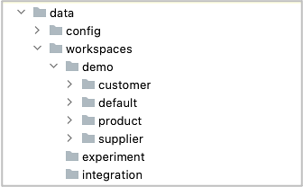
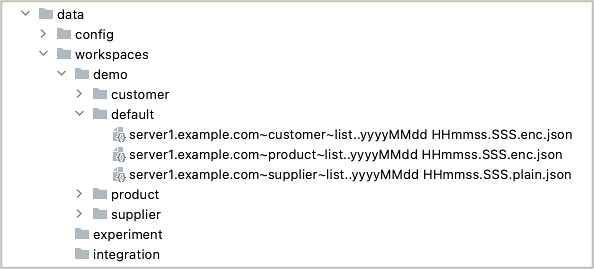
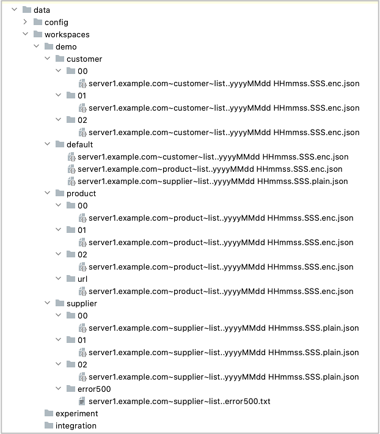

# workspaces

You can create multiple workspaces in data/workspaces directory.

## Example



In this case, workspaces are following.

- demo
- experiment
- integration

Current workspace is `demo` (configured in `stubConfig.json`).

```
{
  "workspaces": "data/workspaces",
  "workspaceName": "demo",
...
```

### demo



demo workspace has four subdirectories.

|directory| description                          |
|:--------|:-------------------------------------|
|default| For default data pattern             |
|customer| For data pattern of CustomerList API |
|product| For data pattern of ProductList API  |
|supplier| For data pattern of SupplierList API |

<br>

### demo/default



The path of subdirectory under the workspace corresponds to data pattern name.



|Data pattern name|description|
|:--------|:----------|
|customer/00|Customer list data (count=0) |
|customer/01|Customer list data (count=1) |
|customer/02|Customer list data (count=2) |
|default|Data files for default data pattern|
|product/00|Product list data (count=0) |
|product/01|Product list data (count=1) |
|product/02|Product list data (count=2) |
|product/url|Product list data with non-ascii characters in url |
|supplier/00|Supplier list data (count=0) |
|supplier/01|Supplier list data (count=1) |
|supplier/02|Supplier list data (count=2) |
|supplier/error500|Http status 500 |

<br>

- [Data directory](data_directory.md)

<br>
