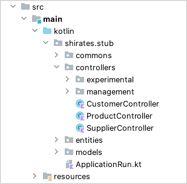

# RestController

shirates-stub is **Spring Boot Application**. So you can implement your own API using **RestController**.

## Sample



### CustomerController

```kotlin
package shirates.stub.controllers

import org.springframework.web.bind.annotation.GetMapping
import org.springframework.web.bind.annotation.RequestMapping
import org.springframework.web.bind.annotation.RestController
import org.springframework.web.client.RestTemplate
import shirates.stub.commons.annotaions.ApiDescription
import shirates.stub.commons.annotaions.StubServer
import shirates.stub.commons.controllers.StubController
import javax.servlet.http.HttpServletRequest

@StubServer("server1")
@RestController
@RequestMapping("/", produces = ["application/json"])
class CustomerController(val restTemplate: RestTemplate) : StubController() {

    @ApiDescription("CustomerList")
    @GetMapping("/customer/list")
    fun getCustomers(request: HttpServletRequest): String {
        val data = getStubData(request, restTemplate)
        return data.toString()
    }

}
```

<br>

- [index](../index.md)

<br>
