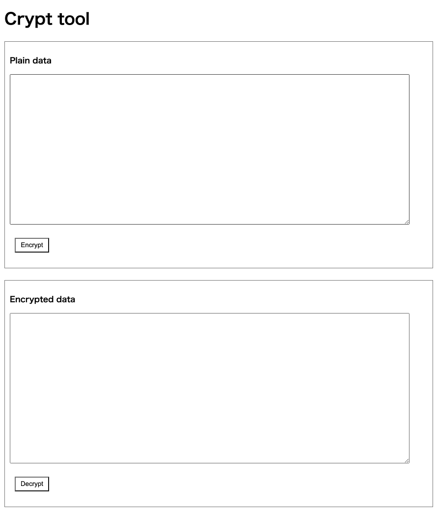
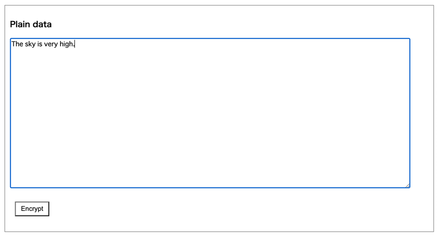
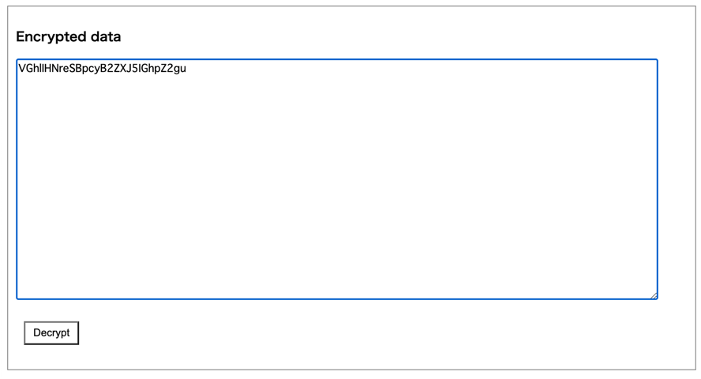

# Crypt tool

You can encrypt/decrypt data on this page.

By default, encryption/decryption are implemented as Base64 encoder/decoder **just for demonstration**.

## Encrypting data

1. Input plain data.

2. Click `Encrypt`.

3. You can see encrypted data.

## Decrypting data

1. Input encrypted data.

2. Click `Decrypt`.

3. You can see decrypted data.

 

- [index](../index.md)

 
