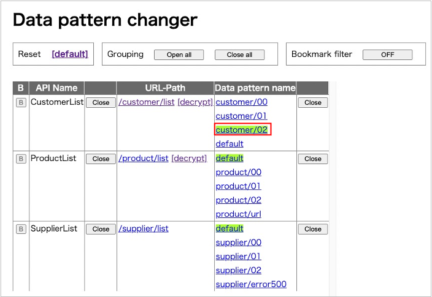

# Data pattern changer

You can see API list and change data pattern on this page.

## Getting data

1. Open data pattern changer.

2. Click hyperlink of `/customer/list`. You can see response data of `CustomerList` API. This is encrypted.

3. Back to Data pattern changer, then click on `[decrypt]` next to `/customer/list`.

4. You can see response data of `CustomerList` API. This is decrypted.

### Console output

## Changing data pattern

1. Click `Open all` to expand item groups.

2. Click data pattern name which you want to use.

3. Click URL-Path to see changed response data.

 

- [index](../index.md)

 
