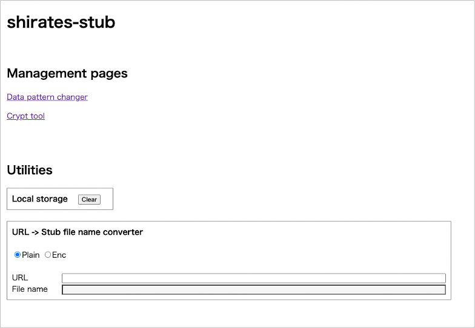

# Quick Start

## Installation

Install following prerequisite tool.

### IntelliJ IDEA

If you have not installed IntelliJ IDEA, download Ultimate or Community and install it.
(Community is open source product)

https://www.jetbrains.com/idea/

<br>

## Getting shirates-stub project

Clone source code project using git.

```shell
git clone https://github.com/ldi-github/shirates-stub.git
```

<br>

## Opening project

1. Open shirates-stub project (double-click on build.gradle.kts)
1. Wait for a while until background tasks finish. It takes minutes.

<br>

## Running stub application

1. Select `ApplicationRunKt`.
2. Click on `Debug`.


3. Open http://localhost/ in browser.



If you encountered SDK problem, try following procedures.

<br>

## Setting SDKs

1. File > Project Structure


2. Delete 1.8, then click OK.


3. Build project. Click `Setup SDK`.


4. Select SDK. 11 or higher is required.


5. Reload gradle


6. Build project.

7. Run application.

### Console output

```
----------------------------------------------------------------------------------------------------
/// 
/// shirates-stub - a stub tool for testing mobile apps -
/// 
----------------------------------------------------------------------------------------------------
lineNo	logDateTime	[logType]	<threadId>	apiName	{dataPattern}	elapsed(ms)	message
1	2022/01/24 09:50:39.145	[INFO]	<17>	-	{}	-	Loading stub configuration. (file=/Users/n.senba/dev/shirates-stub/data/config/stubConfig.json)
2	2022/01/24 09:50:39.153	[INFO]	<17>	-	{}	-	Loading keys. (file=/Users/n.senba/dev/shirates-stub/data/config/keys/staging.keys.json)
3	2022/01/24 09:50:39.154	[INFO]	<17>	-	{}	-	Setting urlPath -> dataPatternName
4	2022/01/24 09:50:39.172	[INFO]	<17>	-	{}	-	"/customer/list" -> "default"
5	2022/01/24 09:50:39.174	[INFO]	<17>	-	{}	-	"/product/list" -> "default"
6	2022/01/24 09:50:39.176	[INFO]	<17>	-	{}	-	"/supplier/list" -> "default"
7	2022/01/24 09:50:39.182	[INFO]	<17>	-	{}	-	Mapping urlPath to ApiDescription.
8	2022/01/24 09:50:39.219	[INFO]	<17>	-	{}	-	["/management/getDataPattern"]="getDataPattern(API)"
9	2022/01/24 09:50:39.219	[INFO]	<17>	-	{}	-	["/management/listDataPattern"]="listDataPattern(API)"
10	2022/01/24 09:50:39.219	[INFO]	<17>	-	{}	-	["/management/resetStubDataManager"]="resetStubDataManager(API)"
11	2022/01/24 09:50:39.220	[INFO]	<17>	-	{}	-	["/management/setDataPattern"]="setDataPattern(API)"
12	2022/01/24 09:50:39.221	[INFO]	<17>	-	{}	-	["/management/changeDataPattern"]="changeDataPattern(Page)"
13	2022/01/24 09:50:39.221	[INFO]	<17>	-	{}	-	["/management/changeAllDataPatternsToDefault"]="changeAllDataPatternsToDefault(Page)"
14	2022/01/24 09:50:39.221	[INFO]	<17>	-	{}	-	["/management/dataPatternChanger"]="dataPatternChanger(Page)"
15	2022/01/24 09:50:39.221	[INFO]	<17>	-	{}	-	["/management/cryptTool"]="cryptTool(Page)"
16	2022/01/24 09:50:39.222	[INFO]	<17>	-	{}	-	["/customer/list"]="CustomerList"
17	2022/01/24 09:50:39.222	[INFO]	<17>	-	{}	-	["/product/list"]="ProductList"
18	2022/01/24 09:50:39.223	[INFO]	<17>	-	{}	-	["/supplier/list"]="SupplierList"
19	2022/01/24 09:50:39.223	[INFO]	<17>	-	{}	-	["/stubtest"]="StubTest"

[stubConfig]
 urlValueEncode: false
 outputRequestBody: true

[Stub management menu] http://stub1/
 Options
 plain ... Decrypt to plain text. ex. http://stub1/customer/list?plain
 format ... Format JSON. ex. http://stub1/customer/list?plain&format
 0 ... Decrypt to plain text, then format JSON. ex. http://stub1/customer/list?0
```

<br>

- [index]

[index]: index.md

<br>
