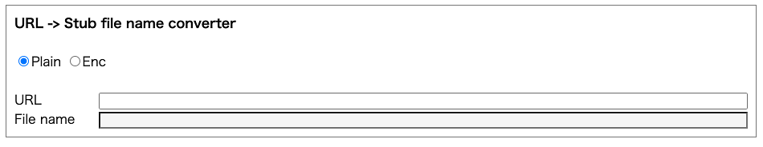
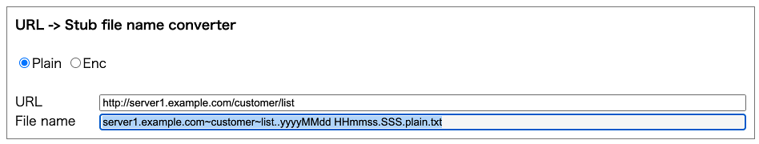

# URL to stub file name converter

You can convert URL of API to stub file name.

1. Input URL of API which you want to get stub file name.

2. Press tab key or click anywhere to focus out.
3. You can see converted file name.

`Plain` option is for plain text (no encryption).

`Enc` option is for encryption.

 

- [index](../index.md)

 
